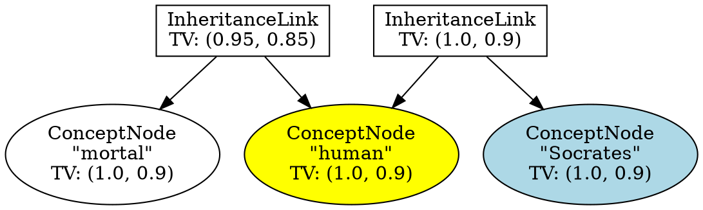

# AtomSpace Visualizations GitHub Pages Template

This template provides a GitHub Actions workflow for generating and deploying AtomSpace visualizations, attention values, and PLN inference traces as static HTML sites.

## About AtomSpace Visualizations

The AtomSpace is the knowledge representation system used in OpenCog. This template helps you visualize graph structures, attention values, and inference traces by converting them to SVG diagrams using Graphviz and embedding them in HTML pages.

## Usage

1. Copy the `deploy.yml` file to `.github/workflows/` in your repository
2. Update the `branches: [$default-branch]` to match your default branch (e.g., `main` or `master`)
3. Create a script to generate `.dot` files from your AtomSpace data
4. Optional: Customize the visualization script and styling
5. Push your changes to trigger the workflow

## Requirements

- A script to export AtomSpace data to Graphviz `.dot` format
- `.dot` files or a generator script
- Optional: Custom HTML templates and CSS

## Example Generator Script

Create a `generate-viz.sh` script:

```bash
#!/bin/bash

# Create output directory
mkdir -p public

# Generate DOT files from AtomSpace data
# (Replace with your actual data export logic)
cat > graphs/atomspace.dot << 'EOF'
digraph AtomSpace {
    rankdir=LR;
    node [shape=box];
    
    ConceptNode1 [label="ConceptNode\n\"human\""];
    ConceptNode2 [label="ConceptNode\n\"mortal\""];
    InheritanceLink [label="InheritanceLink\nTV: (0.9, 0.8)"];
    
    InheritanceLink -> ConceptNode1;
    InheritanceLink -> ConceptNode2;
}
EOF

# Convert DOT files to SVG
for dot_file in graphs/*.dot; do
    base_name=$(basename "$dot_file" .dot)
    dot -Tsvg "$dot_file" -o "public/${base_name}.svg"
done

# Generate HTML index
cat > public/index.html << 'EOF'
<!DOCTYPE html>
<html>
<head>
    <meta charset="utf-8">
    <title>AtomSpace Visualizations</title>
    <style>
        body { font-family: sans-serif; margin: 2em; }
        .viz { border: 1px solid #ccc; margin: 1em 0; padding: 1em; }
    </style>
</head>
<body>
    <h1>AtomSpace Visualizations</h1>
EOF

for svg_file in public/*.svg; do
    base_name=$(basename "$svg_file")
    display_name="${base_name%.svg}"
    {
        echo '    <div class="viz">'
        echo "        <h2>${display_name}</h2>"
        echo "        "
        echo '    </div>'
    } >> public/index.html
done

cat >> public/index.html << 'EOF'
</body>
</html>
EOF
```

## Example AtomSpace DOT Format



## Features

- Visualize AtomSpace graph structures
- Display attention values and truth values
- Show PLN inference traces
- Make AGI system internals visible and explorable
- Interactive web-based exploration
- Support for complex graph relationships

## Learn More

- [OpenCog AtomSpace](https://wiki.opencog.org/w/AtomSpace)
- [Graphviz Documentation](https://graphviz.org/documentation/)
- [PLN (Probabilistic Logic Networks)](https://wiki.opencog.org/w/PLN)
- [GitHub Pages Documentation](https://docs.github.com/pages)
